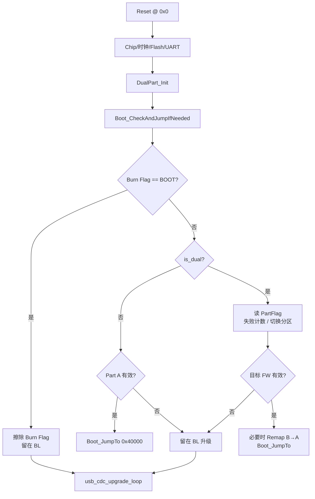

# BanAirBundy Boot 框架详解

> 覆盖 **Bootloader**、**boot_app（APP）**、**USB CDC 升级协议**、**上位机工具** 及 Flash 分区布局。  
> 以仓库当前源码为准；运行时默认为 **2 MB 内部 Flash + 单分区 A**，头文件同时定义 **8 MB 双分区 A/B** 布局。

---

## 1. 概述

本系统采用「独立 Bootloader + 链接在 `0x00040000` 的 APP」架构：

| 角色 | 工程目录 | 链接基址 | 主要职责 |
|------|----------|----------|----------|
| Bootloader | `bootloader/` | `0x00000000` | 启动决策、跳转 APP、USB CDC 固件升级 |
| APP | `boot_app/` | `0x00040000` | FreeRTOS + USB 音频/CDC 业务；可请求回到 BL |
| 上位机 | `update_tool/` | — | 扫描串口、进入 Boot、烧录固件 |

**设计目标：**

1. 上电由 BL 判断是否跳转 APP，或停留在升级模式  
2. BL 与 APP 通过 **BootInfo + Handoff** 安全交接（共享 SRAM `.data` 窗口）  
3. 主机可通过 CDC 完成固件升级；APP 运行时可通过 `boot\r\n` 回到 BL  
4. Flash 容量足够时自动启用 **A/B 双分区**与启动失败回退  

---

## 2. 目录与职责

```
BanAirBundy/
├── bootloader/                         # 独立 BL 工程
│   ├── nds32-ae210p.ld                 # 链接 @ 0x0
│   ├── src/main.c                      # 时钟/Flash/决策 → CDC 升级循环
│   └── src/firmware_upgrade/
│       ├── dual_partition.h            # 地址/魔数/协议常量（BL 侧权威）
│       ├── boot_decision.c             # DualPart / PartFlag / Jump / BurnFlag
│       ├── app_upgrade.c               # 升级协议引擎
│       └── cdc_upgrade.c               # USB CDC 桥接
│
├── boot_app/                           # FreeRTOS APP
│   ├── nds32-ae210p.ld                 # 链接 @ 0x40000
│   ├── src/main.c                      # USB 复合设备、boot 命令、调度器
│   ├── startup/init-default.c          # BootInfo / BGPF / Handoff 检测
│   ├── system_config/app_config.h      # HAS_BOOTLOADER、USB 模式
│   └── banux/05_component/firmware_upgrade/
│       ├── dual_partition.h            # 与 BL 对齐的布局定义
│       ├── boot_decision.c             # APP 侧分区感知（不负责跳转）
│       ├── fw_upgrade.c                # Burn Flag / BootInit 门面
│       └── app_upgrade.c               # APP 内升级实现（当前主路径未接入）
│
├── update_tool/
│   ├── bg_bootloader.py                # PyQt GUI（「进入 Boot」发 boot\r\n）
│   ├── bl_core.py                      # 协议帧 / CRC / Bootloader 操作类
│   └── worker.py                       # 后台扫描与升级线程
│
└── docs/BOOT_FRAMEWORK.md              # 本文档
```

> **维护注意：** BL 与 APP 各有一份 `dual_partition.h` / 升级相关代码，修改常量时必须两边同步。

---

## 3. Flash / 内存映射

### 3.1 链接与 SRAM

| 工程 | 代码基址 (Flash) | `.data` VMA (SRAM) | 说明 |
|------|------------------|--------------------|------|
| bootloader | `0x00000000` | `0x20004000` | 与 APP **共用同一 SRAM 窗口** |
| boot_app | `0x00040000` | `0x20004000` | 跳转前 BL 必须预拷贝 `.data`、清 `.bss` |

APP 堆区（`heap_5s`，与 `.data` 分离）：

| 宏 | 值 | 说明 |
|----|-----|------|
| `BOOT_APP_HEAP_START` | `0x20010000` | 固定堆起点 |
| `BOOT_APP_HEAP_SIZE` | `0x20000` (128 KB) | 至 `0x20030000` |

> 不要使用 `_end .. BP15_HEAP_END` 作为堆：USB 枚举与 TCM/BB 保留区会破坏 freelist。

### 3.2 分区常量（`dual_partition.h`）

```c
#define BOOTLOADER_SIZE         0x00040000UL   /* 256 KB */
#define INTERNAL_ROM_CAPACITY   0x00200000UL   /* 当前：2 MB */
#define PART_A_BASE             0x00040000UL
#define PART_A_SIZE             0x00200000UL   /* 最大 2 MB */
#define PART_B_BASE             0x00240000UL
#define PART_B_SIZE             0x00200000UL
#define PART_FLAG_ADDR_DEFAULT  0x00440000UL   /* 8 MB Flash 时 */
#define PART_FLAG_MAGIC         0x42475057UL   /* "BGPW" */
#define FLASH_SECTOR_SZ         0x1000UL       /* 4 KB */

#define BURN_FLAG_ADDR          0x0003F000UL   /* BL 区最后一扇区 */
#define BURN_FLAG_MAGIC         0x4F4F5442UL   /* "BOOT" LE */
#define BURN_FLAG_SECTOR        (BURN_FLAG_ADDR / 4096U)  /* 63 */

#define FW_VALID_MAGIC          0x42475046UL   /* "BGPF" @ +0xA4 */
#define FW_VALID_MAGIC_OFFSET   0x000000A4UL
#define BOOT_FAIL_MAX           3
```

### 3.3 布局示意

**当前 2 MB（`INTERNAL_ROM_CAPACITY = 0x200000`）→ 单分区：**

```
0x000000 ─┬─ Bootloader (256 KB)
          │
0x0003F000┼─ Burn Flag 扇区 (4 KB，一次性停留 BL)
          │
0x00040000┼─ Partition A / boot_app
          │
~0x1FF000 ┼─ PartFlag（Flash 末扇区）
0x200000 ─┴─ Flash 结束
            （PART_B_BASE=0x240000 超出容量 → is_dual=0）
```

**设计目标 8 MB 双分区：**

```
0x000000 - 0x03FFFF   Bootloader          256 KB
0x040000 - 0x23FFFF   Partition A         2 MB
0x240000 - 0x43FFFF   Partition B         2 MB
0x440000 - 0x440FFF   PartFlag            4 KB
0x441000 - 0x7FFFFF   系统数据等          ~3.75 MB
```

`DualPart_Init()` 根据 `INTERNAL_ROM_CAPACITY` 计算 `part_a_usable` / `part_b_usable` / `part_flag_addr` / `is_dual`。

---

## 4. BootInfo 与 Handoff

### 4.1 为何需要预拷贝

BL 与 APP 的 `.data`/`.bss` 都映射到 **同一 SRAM VMA**（`0x20004000`）。若 BL 直接跳到 APP `_start` 再由 APP 从 Flash 拷贝 `.data`，在 NDS32 XIP 场景下可能死锁。因此 **由 BL 在跳转前** 根据 APP 镜像内的 BootInfo 完成拷贝与清零。

### 4.2 BootInfo（嵌入 APP，偏移 `+0x104`）

定义于 `dual_partition.h`，由 `boot_app/startup/init-default.c` 的 `stub()` 嵌入：

```c
#define BOOT_INFO_MAGIC    0x42474F46UL  /* "BGOF" */
#define BOOT_INFO_OFFSET   0x00000104UL
#define BOOT_HANDOFF_ADDR  0x20000000UL
#define BOOT_HANDOFF_MAGIC 0xDEADBEEFUL

typedef struct {
    uint32_t magic;      /* BOOT_INFO_MAGIC */
    uint32_t data_lma;   /* Flash 中 .data 源 */
    uint32_t data_vma;   /* SRAM 目标 */
    uint32_t data_end;
    uint32_t bss_vma;
    uint32_t bss_end;
} BootInfo_t;
```

固件有效魔数 **BGPF** 位于分区基址 `+0xA4`（向量表之后的 `.stub_section`）。

### 4.3 `Boot_JumpTo(addr)` 步骤

实现：`bootloader/src/firmware_upgrade/boot_decision.c`

1. 关看门狗、关全局中断、`DataCacheInvalidAll()`（**不**失效 I-Cache）  
2. 读 `(addr + 0x104)` 的 BootInfo  
3. 若 magic 匹配：从 LMA 拷贝 `.data` 到 VMA，清零 `.bss`  
4. 写 `*(uint32_t *)0x20000000 = 0xDEADBEEF`  
5. `entry = (void(*)(void))addr; entry();`  

跳转后 DBG 不可用（BL `.data` 已被覆盖），仅用 UART1 `diag_putc`：

| 字符 | 含义 |
|------|------|
| `P` | 进入 BootInfo 处理 |
| `d` | `.data` 拷贝完成 |
| `z` | `.bss` 清零完成 |
| `H` | Handoff magic 已写 |
| `J` | 即将跳转 |
| `?` | BootInfo magic 不匹配 |

### 4.4 APP `__c_init()` 行为

若 `0x20000000 == 0xDEADBEEF`：清除标志并 **跳过** ROM 拷贝/bss 清零（BL 已完成）。  
否则走正常启动路径。APP 还需将 IVB 设为自身 `__executable_start`（`0x40000`），避免使用 BL 在 `0x0` 的向量表。

---

## 5. 启动流程

### 5.1 上电 → Bootloader



要点：

- USB 时钟：**DPLL / 5 = 48 MHz**（`Clock_USBClkDivSet(5)`）。div=4（60 MHz）会导致 EP0 枚举失败。  
- Burn Flag 读取前必须 `DataCacheInvalidAll()`，避免软复位后 D-Cache 脏数据误判。  
- 无有效固件时 BL **不跳转**，直接进入 CDC 升级。

### 5.2 固件有效性 `fw_looks_valid(base)`

满足任一即认为有效：

1. `*(base + 0xA4) == FW_VALID_MAGIC`（`0x42475046` / `"BGPF"`）  
2. 首字既非 `0xFFFFFFFF` 也非 `PART_FLAG_MAGIC`

### 5.3 双分区启动失败回退

- 每次跳转前：`boot_fail_cnt++` 并写回 PartFlag  
- `boot_fail_cnt >= BOOT_FAIL_MAX (3)`：切换到另一分区  
- APP 启动成功后：`FwUpgrade_ConfirmBootSuccess()` → `Boot_ConfirmSuccess()` 将失败计数清零  
- 运行 Part B 时：硬件 Remap 把 `[0x40000, 0x240000)` 映射到 B 区物理 Flash，CPU 仍从 `0x40000` 取指

### 5.4 APP 启动（`HAS_BOOTLOADER=1`）

```
Boot_JumpTo(0x40000)
  → APP _start / __c_init（handoff）
  → main()
       → 跳过 Chip_Init/PLL（BL 已配置）
       → FwUpgrade_BootInit()          // DualPart_Init + Boot_CheckAndJump
       → FwUpgrade_ConfirmBootSuccess()
       → prvInitialiseHeap()           // 0x20010000, 128KB
       → App_UsbInit()                 // AUDIO_CDC
       → NVIC_EnableIRQ(SWI_IRQn)      // FreeRTOS 上下文切换必需
       → xTaskCreate + vTaskStartScheduler()
```

---

## 6. 进入 Boot 升级模式

| 路径 | 触发 | 机制 |
|------|------|------|
| **① ASCII（推荐）** | GUI「进入 Boot 模式」 | 向 APP CDC 发 `boot\r\n` → `App_CdcBootCommandProcess()` → `FwUpgrade_RebootToBootloader()` |
| **② Burn Flag API** | APP 代码/调试 | 直接调用 `FwUpgrade_RebootToBootloader()` |
| **③ 协议 `CMD_ENTER_BOOT(0x0B)`** | `bl_core.enter_boot_from_app()` | APP 侧协议处理存在，但当前 `main` 未接入完整 CDC 升级循环（见「已知缺口」） |

### 6.1 Burn Flag 写入（APP）

`boot_app/banux/05_component/firmware_upgrade/fw_upgrade.c` → `FwUpgrade_RebootToBootloader()`：

1. `GIE_DISABLE()`  
2. Flash 解保护 → `FlashErase(BURN_FLAG_ADDR, 4KB)`  
3. `SpiFlashWrite(..., IsSuspend=0)` 写入 `BURN_FLAG_MAGIC`  
4. `SpiFlashRead` + `DataCacheInvalidAll` 校验  
5. 校验失败则 **不复位**；成功则 `Reset_McuSystem()`  

### 6.2 Burn Flag 消费（BL）

`Boot_CheckAndJumpIfNeeded()`：

1. Cache invalidate 后读 `0x3F000`  
2. 若为 `0x4F4F5442`：擦除该扇区（一次性），**不跳 APP**  
3. 进入 `usb_cdc_upgrade_loop()`  

再次普通复位时 Flag 已清空，将按正常逻辑跳 APP。

---

## 7. USB CDC 升级协议

### 7.1 帧格式

```
[SOF:1][CMD:1][SEQ:2 BE][LEN:2 BE][DATA:len][CRC16:2 BE]

SOF  = 0xAA
CRC16-CCITT: poly=0x1021, init=0xFFFF，覆盖 CMD+SEQ+LEN+DATA
UPG_VERSION   = 0x04
UPG_MAX_CHUNK = 256
```

实现：`bootloader/.../app_upgrade.c`，上位机：`update_tool/bl_core.py`。

### 7.2 命令表

| CMD | 值 | 方向 | 说明 |
|-----|-----|------|------|
| `CMD_SYNC` | `0x01` | H→D | 握手，ACK 含协议版本 |
| `CMD_START` | `0x02` | H→D | 携带固件 size（BE），擦除目标区 |
| `CMD_DATA` | `0x03` | H→D | offset(BE) + ≤256B payload |
| `CMD_FINISH` | `0x04` | H→D | 校验 BGPF，双分区时更新 PartFlag |
| `CMD_JUMP` | `0x05` | H→D | 触发 `Boot_CheckAndJumpIfNeeded()` |
| `CMD_ERASE` | `0x06` | H→D | 擦除升级目标区 |
| `CMD_QUERY_INFO` | `0x07` | H→D | 返回 `DevInfo_t`（20 字节） |
| `CMD_SET_PART` | `0x08` | H→D | 上位机有实现；**当前 BL 未处理（NACK）** |
| `CMD_REBOOT` | `0x09` | H→D | `Reset_McuSystem()` |
| `CMD_ENTER_BOOT` | `0x0B` | H→D | 已在 BL 时 ACK；用于从 APP 进 BL（需 APP 接入） |
| `RSP_ACK` | `0xA1` | D→H | 成功 |
| `RSP_NACK` | `0xA2` | D→H | +1B 错误码 |

**NACK 错误码：**

| 码 | 宏 | 含义 |
|----|-----|------|
| `0x01` | `UPG_ERR_CRC` | CRC 错误 |
| `0x02` | `UPG_ERR_FLASH` | Flash 操作失败 |
| `0x03` | `UPG_ERR_SIZE` | 尺寸非法 |
| `0x04` | `UPG_ERR_STATE` | 状态机错误 |
| `0x05` | `UPG_ERR_PARAM` | 参数错误 |
| `0x06` | `UPG_ERR_WRONG_PART` | 分区不允许写 |

### 7.3 `DevInfo_t`（QUERY_INFO）

```c
typedef struct {
    uint8_t  boot_mode;      /* 0=单分区, 1=双分区 */
    uint8_t  active_part;
    uint8_t  boot_fail_cnt;
    uint8_t  protocol_ver;   /* 0x04 */
    uint32_t part_a_base;    /* LE，自 offset 4 起 */
    uint32_t part_a_size;
    uint32_t part_b_base;
    uint32_t part_b_size;
} DevInfo_t;
```

### 7.4 升级目标选择

- **单分区**：写 `PART_A_BASE (0x40000)`，覆盖当前 APP  
- **双分区**：写 **非活跃** 分区；`CMD_FINISH` 将 `active_part` 切到新分区并设 `boot_fail_cnt = 1`

### 7.5 典型升级时序

```
1. 连接 BL CDC（VID 0x8888 / PID 0x1722）
2. SYNC (0x01)
3. QUERY_INFO (0x07)
4. START (0x02) + size
5. DATA (0x03) × N
6. FINISH (0x04)
7. JUMP (0x05) 或设备自动复位后按 PartFlag 启动
```

擦除过程中 BL 会周期性处理 USB EP0，避免长时间擦除导致主机掉枚举。

---

## 8. USB 模式对比

| 项目 | Bootloader | boot_app |
|------|------------|----------|
| 模式 | `CDC_ONLY (12)` | `AUDIO_CDC (9)`（默认） |
| VID | `0x8888` | `0x8888` |
| PID | `0x1722`（硬编码） | `USBPID(9) = 0x1717+9 = 0x1720` |
| 功能 | 纯升级 CDC | Speaker ISO + CDC ACM |
| 配置宏 | `bootloader/src/main.c` | `BOOT_APP_USB_MODE` / `CFG_PARA_USB_MODE` |

`AUDIO_CDC` 与片上 FIFO 匹配：Speaker ISO OUT `0x02` + CDC；若选 `AUDIO_MIC_CDC`，Mic ISO IN `0x84` 可能无对应 FIFO，导致枚举/业务异常。

Windows 侧要求：设备类 `EF/02/01` + IAD，以便加载 `usbser.sys`。

---

## 9. FreeRTOS / SWI 注意点

| 项 | 说明 |
|----|------|
| 堆 | `heap_5s` + `vPortDefineHeapRegions()`，固定 `0x20010000` / 128KB |
| SWI | 链接脚本 `KEEP(.startup_section)`，`os_cpu_a.S` 使用 `.section .startup_section, "ax"` |
| 使能 | `vTaskStartScheduler()` 前必须 `NVIC_EnableIRQ(SWI_IRQn)` |
| BL 遗留中断 | `HAS_BOOTLOADER` 路径下 APP 入口先关 GIE，避免 BL SysTick 干扰 |

---

## 10. 关键 API 速查

| 模块 | 函数 | 职责 |
|------|------|------|
| BL `main.c` | `usb_cdc_upgrade_loop()` | CDC_ONLY 枚举 + 升级主循环 |
| BL `boot_decision.c` | `Boot_CheckAndJumpIfNeeded()` | BurnFlag / 分区决策 / 跳转 |
| BL `boot_decision.c` | `Boot_JumpTo()` | BootInfo 拷贝 + handoff + 跳转 |
| BL `app_upgrade.c` | `App_Upgrade_ProcessChannel()` | 协议状态机 |
| BL `cdc_upgrade.c` | `CDC_Upgrade_Process()` | CDC ↔ 协议桥 |
| APP `main.c` | `App_CdcBootCommandProcess()` | 解析 `boot\r\n` |
| APP `fw_upgrade.c` | `FwUpgrade_RebootToBootloader()` | 写 Burn Flag 并复位 |
| APP `fw_upgrade.c` | `FwUpgrade_BootInit()` | DualPart + 分区自检 |
| APP `init-default.c` | `__c_init()` / `stub()` | Handoff、BGPF、BootInfo |
| 上位机 | `Bootloader.upgrade()` 等 | 帧构建与烧录流程 |
| 上位机 GUI | `_on_enter_boot()` | 发送 `boot\r\n` |

---

## 11. 常量速查表

```
APP 基址:              0x00040000
Bootloader 大小:       0x00040000 (256 KB)
Burn Flag 地址:        0x0003F000
Burn Flag Magic:       0x4F4F5442 ("BOOT")
PartFlag Magic:        0x42475057 ("BGPW")
FW Valid Magic:        0x42475046 ("BGPF") @ +0xA4
BootInfo Magic:        0x42474F46 ("BGOF") @ +0x104
Handoff:               0x20000000 = 0xDEADBEEF
协议 SOF / 版本:       0xAA / 0x04
BL USB:                VID 0x8888 / PID 0x1722
APP USB (AUDIO_CDC):   VID 0x8888 / PID 0x1720
进入 BL (APP CDC):     "boot\r\n"
```

---

## 12. 维护指南

### 12.1 修改 Flash 容量 / 启用双分区

1. 同步修改两边 `dual_partition.h` 的 `INTERNAL_ROM_CAPACITY`  
2. 确认 `DualPart_Init()` 算出 `is_dual=1`  
3. 用上位机 `QUERY_INFO` 核对 `boot_mode`、分区大小  

### 12.2 修改 APP 链接基址

需同步：

- `boot_app/nds32-ae210p.ld`  
- `flash_config.h` 的 `APP_CODE_ADDR`  
- `dual_partition.h` 的 `PART_A_BASE` / `BOOTLOADER_SIZE`  
- `init-default.c` 中 BootInfo / IVB 相关假设  

### 12.3 新增/裁剪固件有效性

保持 APP `stub()` 中 `0x42475046 @ +0xA4`；`CMD_FINISH` 与 `fw_looks_valid()` 依赖该魔数。

### 12.4 已知缺口

1. **`CMD_SET_PART (0x08)`**：头文件与上位机已定义，BanAirBundy BL `app_upgrade.c` 未实现（会 NACK）。可参考 `wireless_mic_bootloader`。  
2. **APP 内完整 CDC 升级**：`boot_app` 的升级代码与 BL 协议未必完全兼容，且主循环未以 BL 同等方式接入；**生产升级应在 Bootloader 模式完成**。  
3. **进入 Boot**：GUI 使用 ASCII `boot\r\n`；`bl_core.enter_boot_from_app()` 的 `0x0B` 路径依赖 APP 侧升级引擎接入。  

### 12.5 调试建议

- UART：关注 `[BOOT]` 日志与 `diag_putc` 序列 `P/d/z/H/J`  
- 写 Burn Flag 失败时 APP 会打印 verify FAILED 且不复位  
- BL 跳 APP 后若无任务调度：检查 SWI 链接段与 `NVIC_EnableIRQ(SWI_IRQn)`  
- USB 枚举失败：优先核对 USB 48 MHz 时钟与 PID/模式  

### 12.6 USB 串号（多板区分）

Windows 用 `VID + PID + iSerialNumber` 绑定 COM 口。固件通过 `Chip_IDGet()` 生成每片唯一的 16 位十六进制串号（不再使用固定 `20250405`）。

上位机串口列表会显示 `[序列号]`，例如：`COM5  —  USB Serial Device (COM5)  [A1B2C3D4E5F60718]`。

烧录新固件后若仍混淆，可拔插 USB 或在设备管理器中卸载旧 COM 实例后再枚举。

---

## 13. 修订记录

| 日期 | 说明 |
|------|------|
| 2026-08-11 | 初版：基于当前 bootloader / boot_app / update_tool 源码整理 |
| 2026-08-12 | 补充 USB 唯一串号（Chip_IDGet）与上位机 SN 显示 |

